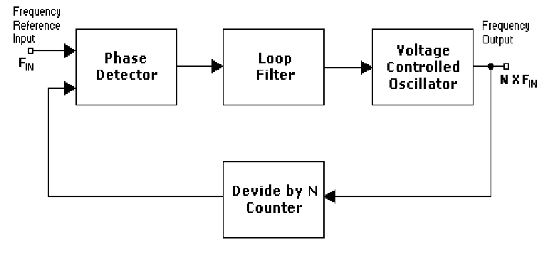
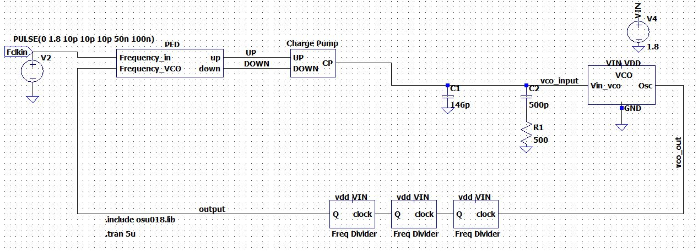
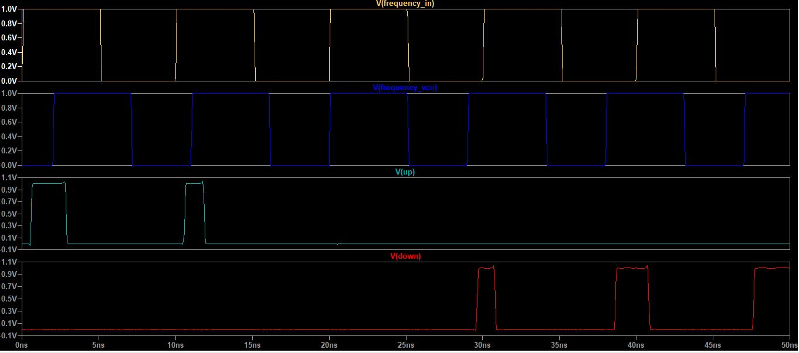
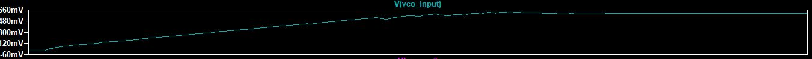
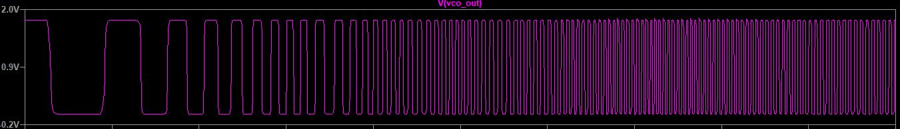
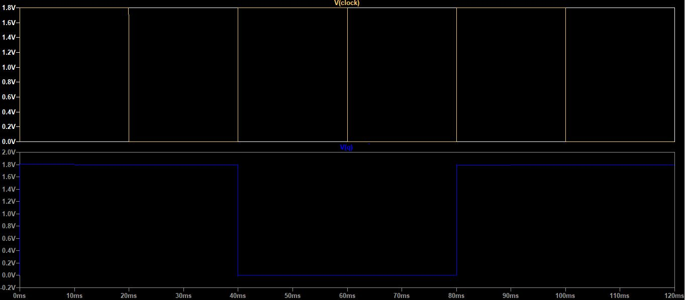

# avsdpll_3v3
This repository will maintain simulation and document files on the PLL IP 

# Introduction to the Phased Lock Loop IP

The given design specifications of the PLL can be found [here](https://github.com/Dhruvajit/avsdpll_3v3/blob/master/Specifications.pdf)

A brief document to the different blocks, principle of working and applications of PLL can be found [here](https://github.com/Dhruvajit/avsdpll_3v3/blob/master/Reports/PLL_OnChipMultiplier.pdf)
# Block diagram of PLL



# Circuit Diagram of the complete PLL IP

PLL schematic with all components


# Pre-Layout Waveforms in LTSPICE

Phase Frequency Divider


Charge Pump along with Loop Filter


Voltage Controlled Oscillator (Oscillating at 60Mhz)


Frequency Divider (Divide by 2)


# About Ngspice
Ngspice is an open source mixed-signal circuit simulator.

**Installing Ngspice**

For Ubuntu, open your terminal and type the following to install Ngspice
> $  sudo apt-get install -y ngspice
To run the Simulation, enter the Ngspice Shell, open the terminal & type:
> $ ngspice
To simulate a netlist, type:
> ngspice 1 ->  source <filename>.cir
You can exit from the Ngspice Shell by typing:
> ngspice 1 ->  exit

# About LTSpice

LTspice is a SPICE-based analog electronic circuit simulator computer software, produced by semiconductor manufacturer Analog Devices.

## Steps to install LTSpice XVII on LINUX

It's not directly supported, so we need to download WineHQ.\
Wine is a linux software that creates windows environment and allows us to run Windows programs.
Copy paste the commands mentioned below one after the other in the terminal for downloading and installing.
```
sudo dpkg --add-architecture i386
wget -O - https://dl.winehq.org/wine-builds/winehq.key | sudo apt-key add -
sudo add-apt-repository 'deb https://dl.winehq.org/wine-builds/ubuntu/ focal main'
sudo apt update
sudo apt install --install-recommends winehq-stable
```

Download [LTSpice](https://www.analog.com/en/design-center/design-tools-and-calculators/ltspice-simulator.html)\
Click on Download for Windows.
Install it by clicking on -> next.
After installing , click on open with WineHQ windows program loader.
```LTSpice is now installed and you can design the circuit```

## Steps to install LTSpice XVII on WINDOWS

Just click on [LTSpice](https://www.analog.com/en/design-center/design-tools-and-calculators/ltspice-simulator.html) and go to Download LTSpice->Download for Windows.\
Now click on the application ltspice from your downloads and accept the T&C and proceed to install.\
```LTSpice is now installed and you can design the circuit.```

# Pre-Layout Performance Characteristics in NGSPICE

have to do

# Future Work

1. To make the PFD more efficient by solving the unaccounted problem of dead zone.
2. To reduce the number of mosfets in Phase Frequency Detector and Voltage Controlled Oscillator to reduce the area of the chip and make the model more power efficent.

# Contributors

- Dhruvajit Ghosh
- Kunal Ghosh
- Philipp Gühring

# Acknowledgement

- Kunal Ghosh, Director, VSD Corp. Pvt. Ltd.
- Philipp Gühring, Software Architect, LibreSilicon Assocation
- Paras Gidd, M.Tech Microelectronics, MIT Manipal

# Contact Information

- Dhruvajit Ghosh, Undergraduate Student, Manipal Academy of Higher Education, ghoshg401@gmail.com
- Kunal Ghosh, Director, VSD Corp. Pvt. Ltd. kunalghosh@gmail.com
- Philipp Gühring, Software Architect, LibreSilicon Assocation pg@futureware.at


