# On Chip Clock Multiplier - Phase Lock Loop (PLL)
This repository will maintain simulation and document files on the PLL IP 

# What is PLL?

Phase lock loop is a feedback control system which consists of a phase detector, voltage controlled oscillator (VCO), and a low pass filter. The oscillator maintains a constant phase angle relative to an input reference signal and is used to detect the phase difference between two signals. The PLL primary function is to generate stable output high frequency from a fixed lower frequency signal so the VCO output frequency can be a multiple of the reference input frequency.

A brief document to the different blocks, principle of working and applications of PLL can be found [here](https://github.com/Dhruvajit/avsdpll_3v3/blob/master/Reports/PLL_OnChipMultiplier.pdf)

# Block diagram of PLL

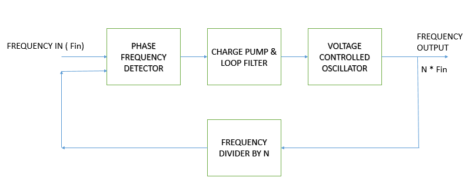

# Circuit Diagram of the complete PLL IP

PLL schematic with all components


# Pre-Layout Waveforms in LTSPICE

Phase Frequency Divider

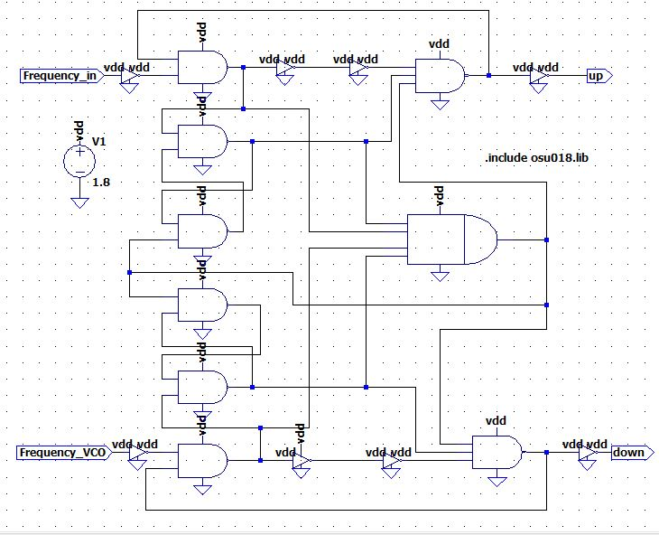

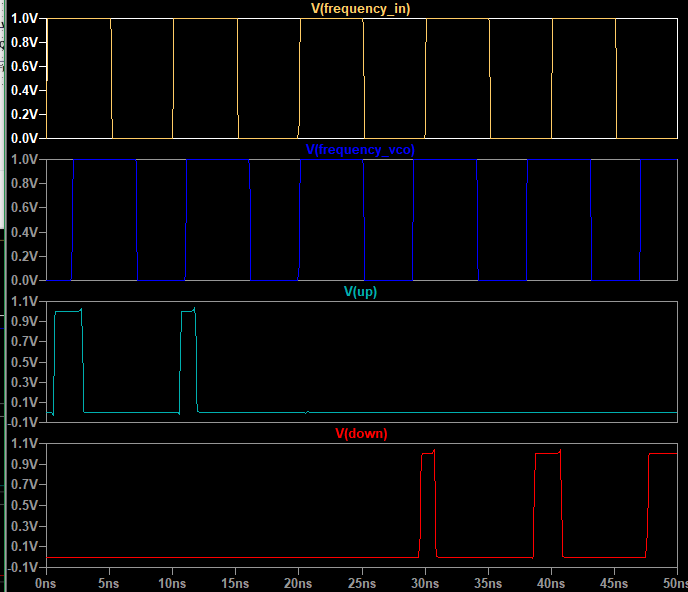

Charge Pump along with Loop Filter

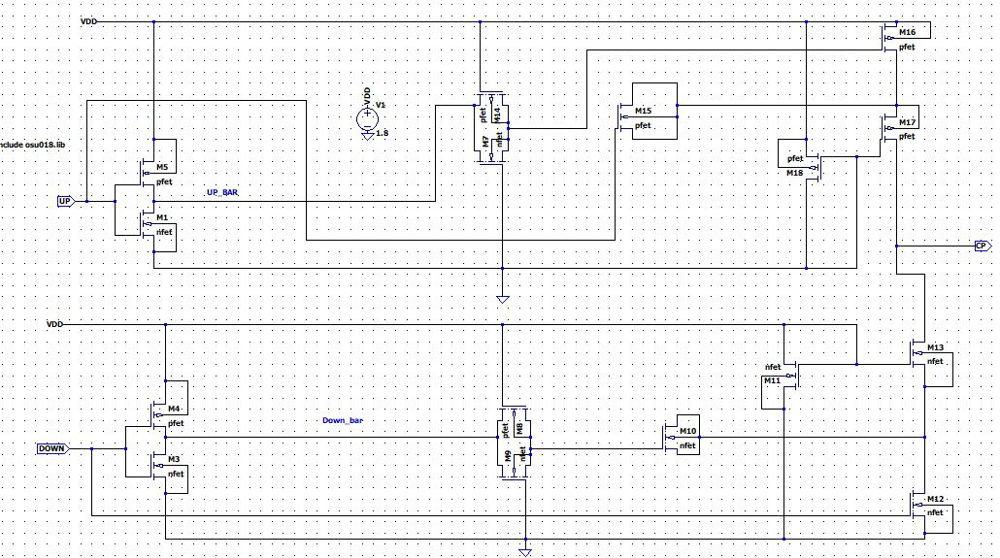

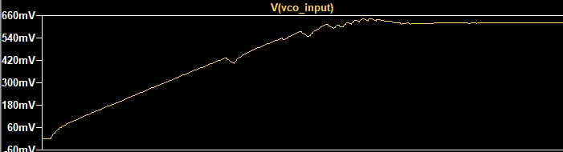

Voltage Controlled Oscillator (Oscillating at 60Mhz)

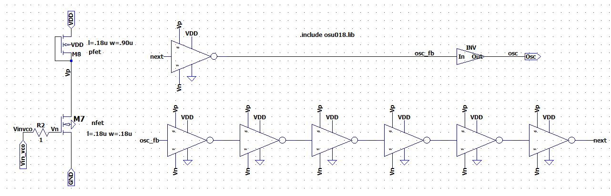

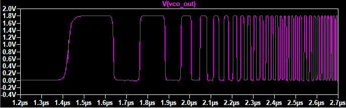

Frequency Divider (Divide by 2)

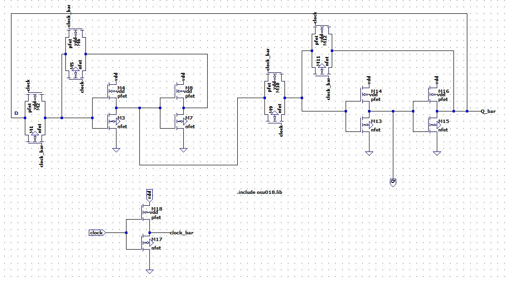

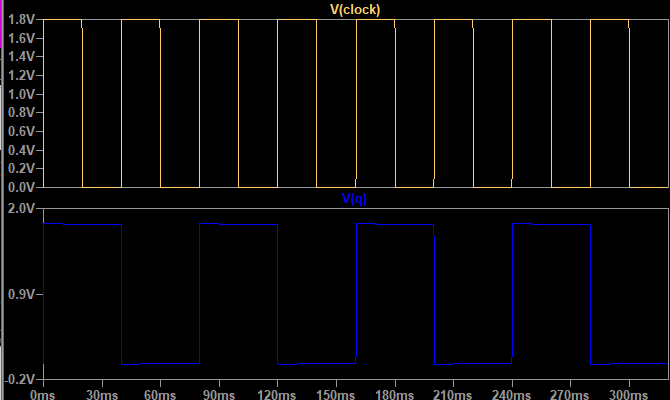

## Phased Lock Loop (F_clkin = 5Mhz & F_clkout = 41Mhz at 1.8V)

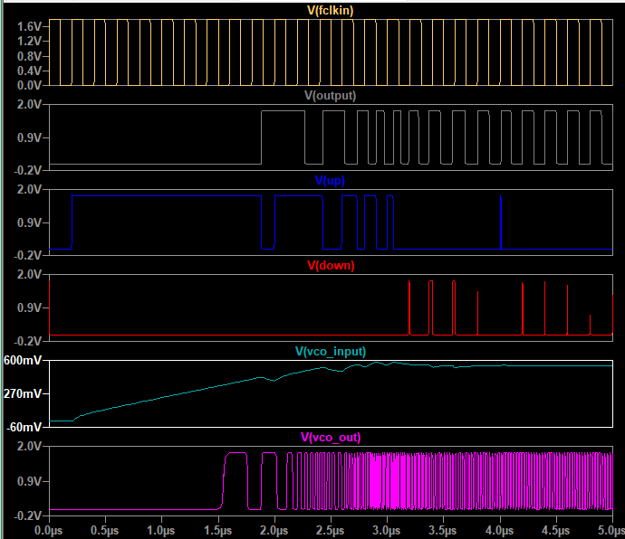

Magnified View of F_clkin & F_clkout (F_clkout = 8 * F_clkin)

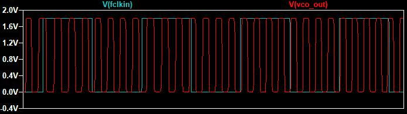

## Phased Lock Loop (F_clkin = 12.5Mhz & F_clkout = 99Mhz at 1.8V)

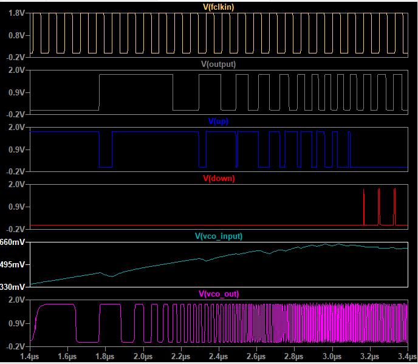

Magnified View of F_clkin & F_clkout (F_clkout = 8 * F_clkin)

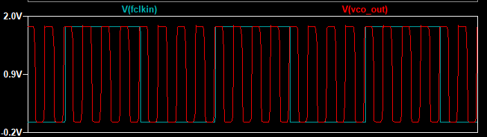

# About Ngspice
Ngspice is an open source mixed-signal circuit simulator.

**Installing Ngspice**

For Ubuntu, open your terminal and type the following to install Ngspice\
``` $  sudo apt-get install -y ngspice```

To run the Simulation, enter the Ngspice Shell, open the terminal & type:\
``` $ ngspice ```

To simulate a netlist, type:\
```> ngspice 1 ->  source <filename>.cir```

You can exit from the Ngspice Shell by typing:\
```> ngspice 1 ->  exit```

# About LTSpice

LTspice is a SPICE-based analog electronic circuit simulator computer software, produced by semiconductor manufacturer Analog Devices.

## Steps to install LTSpice XVII on LINUX

It's not directly supported, so we need to download WineHQ.\
Wine is a linux software that creates windows environment and allows us to run Windows programs.
Copy paste the commands mentioned below one after the other in the terminal for downloading and installing.
```
sudo dpkg --add-architecture i386
wget -O - https://dl.winehq.org/wine-builds/winehq.key | sudo apt-key add -
sudo add-apt-repository 'deb https://dl.winehq.org/wine-builds/ubuntu/ focal main'
sudo apt update
sudo apt install --install-recommends winehq-stable
```

Download [LTSpice](https://www.analog.com/en/design-center/design-tools-and-calculators/ltspice-simulator.html)\
Click on Download for Windows.
Install it by clicking on -> next.
After installing , click on open with WineHQ windows program loader.
```LTSpice is now installed and you can design the circuit```

# Pre-Layout Performance Characteristics in NGSPICE

To clone the Repository and download the Netlist files for Simulation, enter the following commands in your terminal.
```
$  sudo apt install -y git
$  git clone https://github.com/Dhruvajit/avsdpll_3v3
$  cd avsdpll_3v3/Reports
````

1. Frequency of CLOCK operating at 5Mhz with 50% Duty cycle 

```
$ ngspice Fclkin.cir
``` 

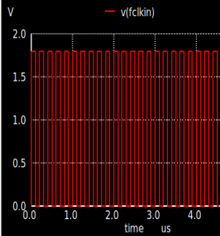

2. Phase Frequency Detector gives output as UP and DOWN

```
$ ngspice UP_DOWN.cir
``` 


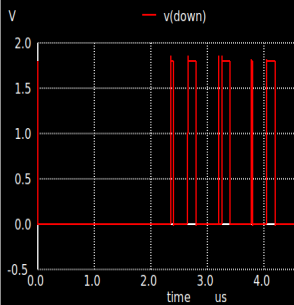

3. Charge Pump along with loop filter helps to regulate the voltage

```
$ ngspice VCO_input.cir 
```

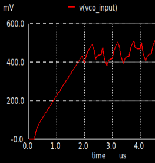

4. Voltage Controlled Oscillator gives the multiplied frequency of the clock and is operating at 41Mhz 

```
$ ngspice VCO_out.cir
```

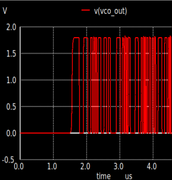

5. Frequency Divider by 8 of the VCO output

```
$ ngspice FreqOut.cir
```

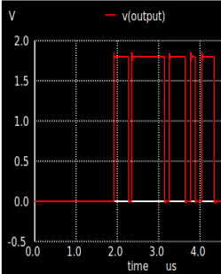

6. PLL output and input simulation
```
$ ngspice PLL_OSU.cir
```
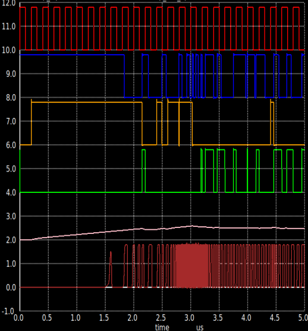


# Future Work

1. To make the PFD more efficient by solving the unaccounted problem of dead zone.
2. To reduce the number of mosfets in Phase Frequency Detector and Voltage Controlled Oscillator to reduce the area of the chip and make the model more power efficent.

# Contact Information

- Dhruvajit Ghosh, Undergraduate Student, Manipal Academy of Higher Education, ghoshg401@gmail.com


